# Texturesynth

This is a Matlab implementation of the Efros-Leung algorithm for texture synthesis by non-parametric sampling.
For details about the algorithm, see [the original paper](https://www.eecs.berkeley.edu/Research/Projects/CS/vision/papers/efros-iccv99.pdf).

## Usage

The following is an example of how the `synthesize_texture` function is used (from `synthesize_texture_test.m`):

```matlab
input_image = im2double(imread('161.png'));
output_image = synthesize_texture(input_image, 256, 256, 9); 
imwrite(output_image, 'result.png');
```

The parameters of `synthesize_texture` are as follows:

```matlab
function output_image = synthesize_texture(input_image, output_rows, output_cols, window_size)
```

### Inputs

* `input_image`: the image containing a sample of the texture to synthesize
* `output_rows`: the desired number of rows in the synthesized image
* `output_cols`: the desired number of columns in the synthesized image
* `window_size`: the side length of the window used to scan across the
                 input image to look for patches that most closely match
                 the region that is being synthesized

### Outputs

* `output_image`: an (output\_rows x output\_cols) image containing the
                  synthesized texture


# Some Examples

## Custom Textures

Input | Output | Window Size
----- | ------ | -----------
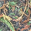 | 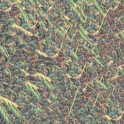 | 15
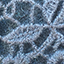 | 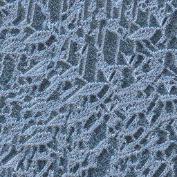 | 15
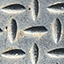 | 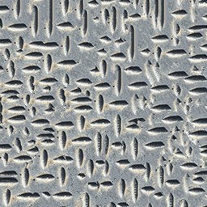 | 15
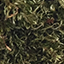 | 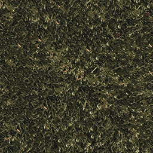 | 9


## Classic Textures

Input | Output | Window Size
----- | ------ | -----------
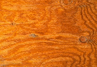 | 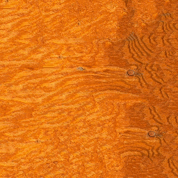 | 15
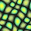 | 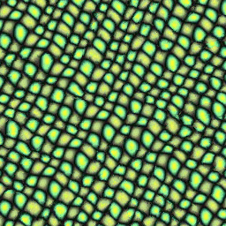 | 15
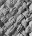 | 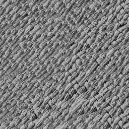 | 21
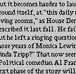 | 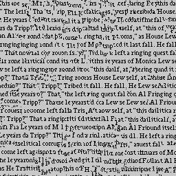 | 21
 

# Format of Examples

The `examples` folder contains two subfolders, `ClassicTextures` and `MyTextures`. `ClassicTextures` 
contains examples of this implementation used on some of the texture samples that were used in the 
original Efros-Leung paper. `MyTextures` contains examples that use my own texture samples.

For each example, the input file is named after the material pictured, and the corresponding 
output file contains the name of the input file, plus "result" and "window," followed by 
the window size used for that example.
For example, input file "bark1.png" has output file "bark1_result_window_9.png" which shows 
that the window size is 9.


# Implementation Notes

In order to handle both grayscale and colour images with the same code, this implementation
stacks channels vertically, so that calculations are always performed using only column vectors.

In this script, the candidate patches are converted to the stacked representation at the start, 
and are kept that way for all the distance computations. 
When looking at an individual pixel to synthesize, the neighbourhood about that pixel is reshaped 
into a single column with channel stacking, and is replicated as many times as there are 
candidate patches. It is important to note that even when there are multiple colour channels, the 
mask showing which pixels have been filled is still two-dimensional. The mask applies 
across all colour channels, so in order to vectorize the code, _the mask is replicated vertically_ 
as many times as there are channels:

```matlab
mask_vec = repmat(mask_vec, size(candidates, 3), 1);
```
